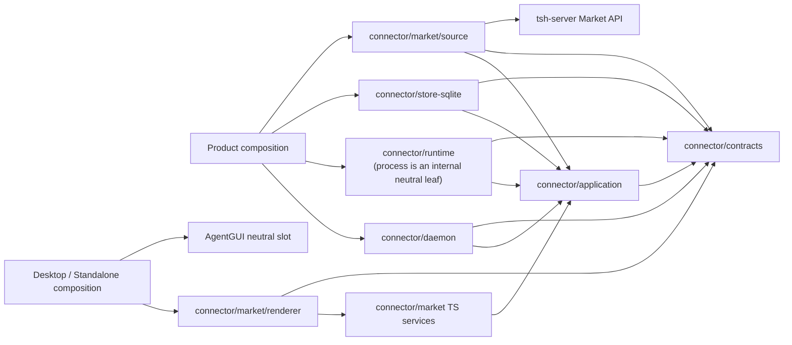
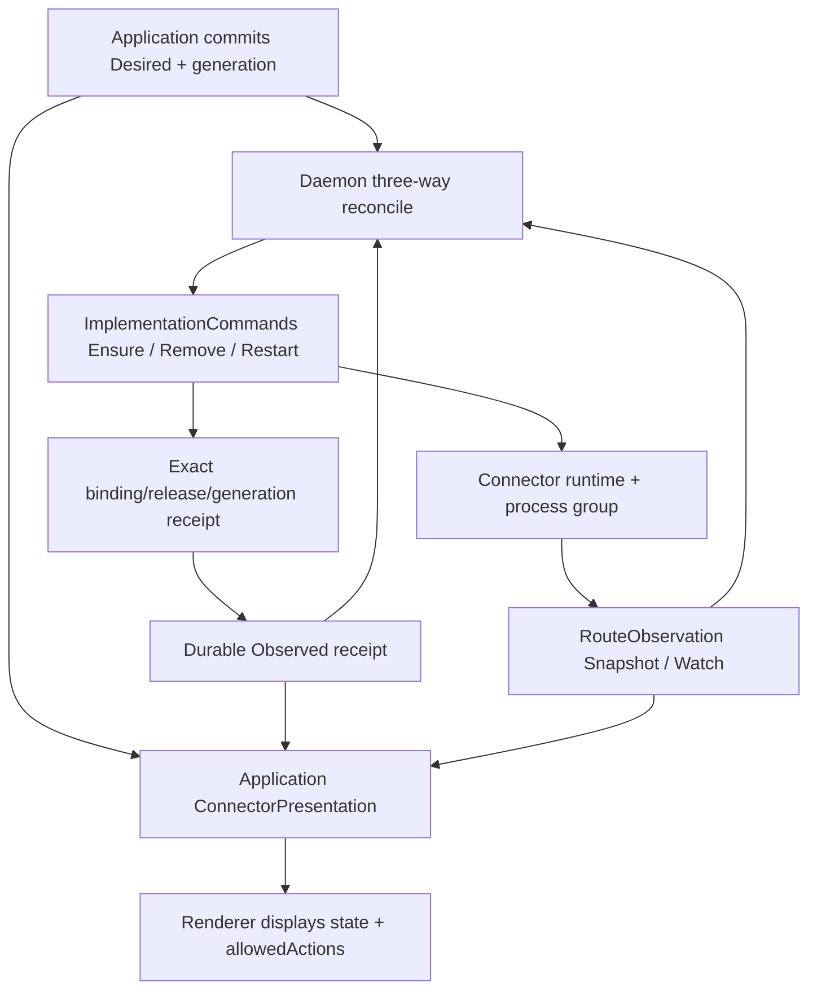
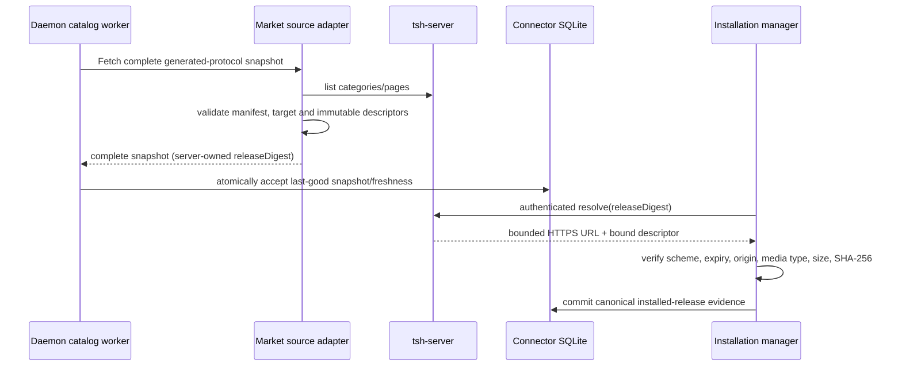
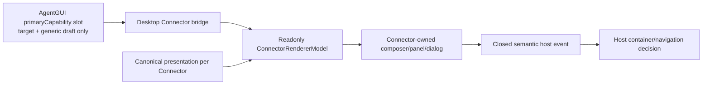
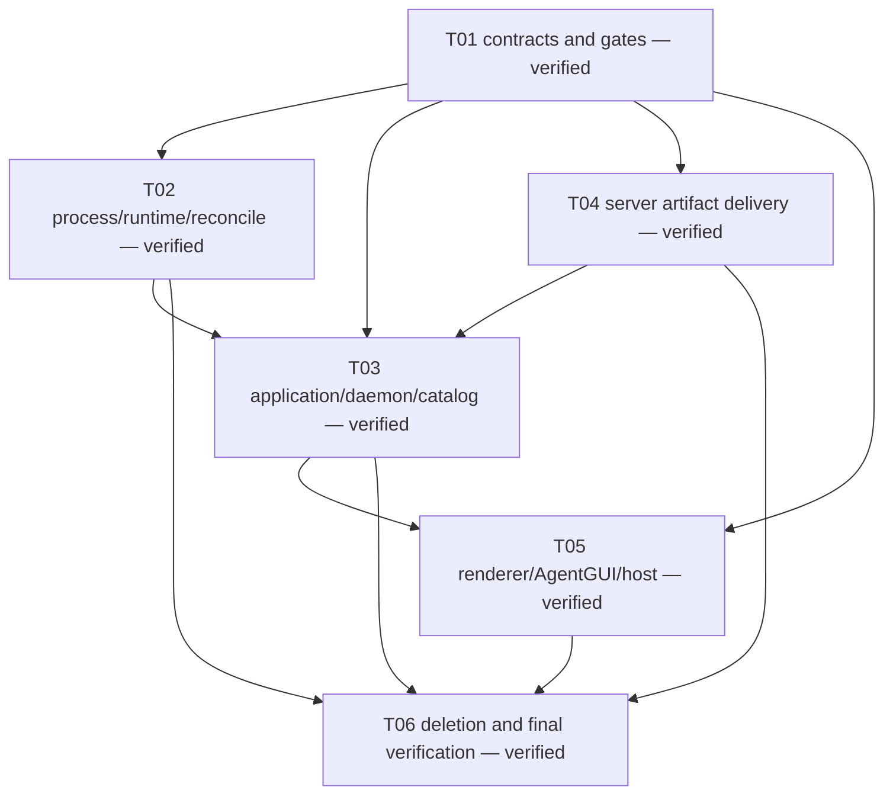

# Connector subsystem refactor

Status: implementation and the Go/TypeScript/static verification matrix are
complete on 2026-08-18. Only root-owned repository closeout remains: normalize
DCO sign-off, run a post-rebase smoke check, and confirm a clean worktree.

This directory is the execution record for the Tutti Connector refactor. The
durable architecture is documented in `docs/architecture/connector-market.md`
and the package READMEs; these task files record scope, sequencing, evidence,
compatibility windows, verification evidence, and repository closeout.

## Fixed architecture decisions

- Tutti owns Connector contracts, application, process/runtime, daemon, Market
  source, TypeScript integration, renderer, i18n, and authorization UI.
- Product hosts own composition, containers, account admission, external
  navigation, and the physical placement of the neutral AgentGUI slot.
- Connector owns its process primitives. No Connector package imports or aliases
  Agent runtime process types.
- One application composition object exposes responsibility-specific query and
  command facets. Daemon workers receive a separate group of narrow maintenance
  ports; no consumer receives the concrete application implementation.
- Runtime binding, connection identity, authorization readiness, availability,
  and presentation are derived once by Connector and consumed as facts.
- `ImplementationCommands` expresses desired effects. `RouteObservation`
  supplies independent physical truth through authoritative snapshots and
  latency-reducing watch events.
- `packages/connector/market/source` is the only Connector owner of the
  generated Market client, remote DTO decoding, pagination, manifest parsing,
  execution-target selection, and artifact descriptor projection.
- `tsh-server` owns `releaseDigest`. Tutti consumes the digest, resolves a
  short-lived URL immediately before installation, and verifies media type,
  SHA-256, and byte size without persisting the URL.
- The application owns the closed ten-state `ConnectorPresentation` and its
  allowed actions. Renderer displays those values and dispatches only allowed
  commands; unknown or malformed presentation fails closed as `unsupported`.
- Renderer owns every Connector component, dialog, status, action, and string.
  AgentGUI owns only an optional, neutral `primaryCapability` slot and generic
  target/draft data; it contains no Connector type, state, copy, or component.
- Local Agents support the validated Connector catalog by default. Shared
  Agents must declare an explicit allowlist. Support is distinct from grant;
  missing, stale, unknown, or incomplete shared policy fails closed.
- `/renderer` is canonical. `/ui` forwards to the same implementation for one
  measured compatibility release, after which it is deleted.
- The cutover has no runtime fallback, dual Market read, duplicate identity
  algorithm, or second renderer.

## Delivered package shape

The implementation uses responsibility-specific sibling modules rather than a
single physical package. Historical references in the task documents to
`packages/connector/host` describe the pre-refactor baseline only; it is not a
target package and no longer exists.

```text
packages/connector/
├── contracts/                       # closed values, commands, policy, views
├── application/                     # use cases, projection, narrow facets
├── daemon/                          # lifecycle, workers, bootstrap, health
├── runtime/
│   ├── process/                     # Connector-owned process primitives
│   ├── implementationhost/          # runtime commands + route observation
│   ├── artifact/                    # verified cache/import/fetch
│   ├── mcp/                         # managed MCP client
│   └── mcpserver/                   # session-bound loopback projection
├── store-sqlite/                    # Connector-owned schema and migrations
├── market/
│   ├── source/                      # sole generated remote Market adapter
│   ├── openapi/                     # local daemon HTTP fragment
│   └── src/
│       ├── contracts/               # TS host-neutral contracts
│       ├── services/                # application-port integration
│       ├── composition/renderer/    # readonly model adapter
│       ├── renderer/                # canonical Connector UI
│       ├── ui/index.ts              # one-release forwarding entry only
│       └── i18n/                    # Connector-owned resources
└── authorization-protocol/          # declarative authorization views/events

packages/agent/gui/                  # neutral primaryCapability slot only
apps/desktop/                        # host composition/navigation only
packages/clients/market-go/          # generated, source-locked server contract
```

## Enforced module DAG



The Go production graph has `contracts` at the bottom, `application` above it,
and daemon, runtime, store-sqlite, and Market source as parallel outer modules.
Product composition constructs and injects those outer adapters separately;
daemon does not instantiate or production-import runtime/store. A daemon-to-
store edge exists only in test fixtures. `runtime/process` is a neutral leaf
inside the runtime module and imports neither contracts nor application.

Durable gates inspect both source imports and `go.mod` require/replace edges.
They reject Connector-to-Agent/Desktop/TSH edges, AgentGUI-to-Connector edges,
React below the renderer boundary, generated Market clients outside
`market/source`, renderer access to daemon transports or mutable roots, and
mismatches among workspace exports, build entries, declarations,
`publishConfig`, and `typesVersions`.

## Runtime and state workflow



Watch events only reduce latency. Periodic jittered snapshots repair lost events
and physical drift. Exact healthy routes are not restarted. Retry state is
durable and per Connector/generation: three failures degrade, six fail and
suppress automatic starts until an explicit new generation or exact healthy
observation resets the budget.

## Catalog and artifact workflow



Catalog queries are local. A failed refresh preserves last-good data. Stale
catalogs remain visible/read-only and keep already installed runtimes usable,
but cannot install, update, or start a new authorization. Cleanup actions such
as cancel, disconnect, uninstall, and draft removal remain available when their
canonical presentation action permits them.

## Renderer and AgentGUI workflow



Only the `select` action can add an unselected Connector to the draft;
`remove_selection` controls cleanup. The host does not derive status or infer a
successful Connector command from navigation.

## Task DAG and current state



| Task | Document                                                                   | State                 |
| ---- | -------------------------------------------------------------------------- | --------------------- |
| T01  | [Contracts and gates](tasks/01-contracts-and-boundaries.md)                | complete and verified |
| T02  | [Runtime process and reconcile](tasks/02-runtime-process-and-reconcile.md) | complete and verified |
| T03  | [Application, daemon, catalog](tasks/03-application-daemon-catalog.md)     | complete and verified |
| T04  | [Server artifact delivery](tasks/04-server-artifact-delivery.md)           | complete and verified |
| T05  | [Renderer and host integration](tasks/05-renderer-agent-gui-host.md)       | complete and verified |
| T06  | [Cutover and verification](tasks/06-cutover-and-verification.md)           | complete and verified |

## Commit and verification strategy

The target is one architecture delivered through independently reviewable
commits: process/runtime and UI ownership, boundaries, last-good catalog,
contracts/application, generated source lock, Market source, one-time canonical
release migration, architecture docs, structured control-plane/lifecycle, and
canonical presentation/health. Tutti commit hashes are intentionally omitted
here because the final DCO normalization rebases this branch; capability and
test evidence are the stable record.

The server protocol is a separate clean three-commit chain on
`codex/connector-artifact-resolve`:

1. `6f9f244ee34314c57b03319c64f78374681d6492`
2. `ae8f51464b111ec3c1d6bc091156ab579d0045d2`
3. `b1bb4de6f71d1068a81e2f3098fdc93a43ca4add`

Tutti's generated Market source lock pins the final server commit and exact
generated-file hashes.

## Compatibility windows and deletion register

| Compatibility item                 | Allowed now                                                                           | Removal gate                                                                              |
| ---------------------------------- | ------------------------------------------------------------------------------------- | ----------------------------------------------------------------------------------------- |
| npm `/ui` entry                    | one release; pure export forwarding to `/renderer`                                    | all supported consumers import `/renderer`                                                |
| server `artifact.key` field        | deprecated response field only; never used by new Tutti domain/download path          | supported clients use resolve and server metrics show no legacy use for one release cycle |
| daemon wire without `presentation` | one old daemon compatibility version; canonical client decoder fails closed/read-only | supported daemon cohort always publishes presentation                                     |
| global mutation revision           | accepted as an older wire fence; application normalizes to one rule                   | supported clients send entity revision                                                    |
| old installed-release rows         | one-time transactional migration input only                                           | migration marker commits; normal reads/writes never consult legacy rows                   |

There is no compatibility permission for a second runtime, second Catalog
source, client-computed release digest, duplicated availability projection, or
AgentGUI Connector fallback.

## Verified definition of done

- T05 consumes only canonical freshness/presentation/actions across Market,
  renderer, dialogs, composer, and Agent policy.
- Focused Go/TypeScript tests, race/vet checks, generated drift checks, boundary
  gates, builds, i18n checks, package-resolution smoke tests, and Windows
  compile/process gates passed on the completed implementation tree.
- Workspace and Standalone share one bridge behavior and each window owns one
  Connector model/dialog host.
- No forbidden legacy edge or duplicated inference remains.
- The implementation has one application projector, one renderer model, and one
  explicit Desktop transport mapper; AgentGUI remains Connector-neutral.

Root closeout will normalize DCO sign-off, rerun post-rebase smoke checks, and
confirm the final Tutti worktree is clean. These repository-hygiene steps do not
change the verified architecture or implementation scope.

See [STATUS.md](STATUS.md) for verification evidence and root closeout.
