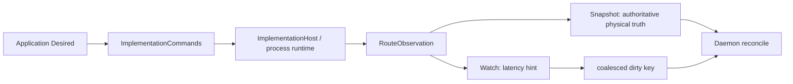

# T02: Connector-owned process, runtime identity, observation, and reconcile

Status: complete and verified.

## Objective and removed coupling

The historical implementation reused Agent runtime process contracts and kept
physical route observation outside the durable reconcile loop. That produced an
unwanted Connector-to-Agent dependency and allowed Desired/Observed equality to
hide a route that had physically disappeared.

The delivered implementation has one Connector-owned process layer, one
runtime-binding/connection-identity authority, independent command and
observation ports, three-way convergence, and one bounded lifecycle.

## Delivered ownership

```text
packages/connector/
├── contracts/                       # binding, generation, readiness, receipts
├── application/                     # intent, convergence, binding resolver
├── runtime/
│   ├── process/                     # process spec/frames/transport/group
│   ├── implementationhost/          # commands and physical observation
│   ├── artifact/                    # verified artifact operations
│   ├── mcp/                         # managed MCP transport
│   └── mcpserver/                   # loopback MCP projection
├── daemon/                          # observation workers + anti-entropy
└── store-sqlite/                    # desired/observed/lease/retry persistence
```

`runtime/process` owns:

- Connector-specific process purpose, launch identity, spec, frame, connection,
  and transport contracts;
- absolute executable/CWD validation and explicit environment construction;
- executable SHA-256/size and artifact tree verification immediately before
  launch;
- bounded stdout/stderr and contextual receive;
- serialized NDJSON writes;
- pending-start fencing, committed process groups, graceful close, terminate,
  kill, and descendant-tree cleanup on Unix and Windows.

It is an independent implementation, not an Agent type alias or a new generic
shared process package. It is a neutral leaf inside the runtime Go module and
imports neither `connector/contracts` nor `connector/application`; its launch
values are runtime-local process values. Connector runtime no longer requires
Agent daemon/runtime.

## Runtime identity and secret lifetime

`RuntimeBindingResolver` is the sole execution authority for:

- Connector key and stable connection ID;
- account/device/session scope;
- account/device identity and transport;
- authorization state and a one-shot reconcile grant.

The side-effect-free `RuntimeIntentResolver` plans the same non-secret identity
but cannot mint a credential. Grants are never persisted, rendered, included in
argv/environment, or returned by observation. Route keys, state roots, receipts,
and command identity consume the resolved binding rather than rebuilding loose
strings.

The v1 algorithm preserves compatible device/account/projected connection
identities. Unknown scope or transport fails closed. Duplicate public helper
hash/prefix construction was removed and is covered by static controls.

## Commands and physical observation



`ImplementationCommands` exposes idempotent `Ensure`, `Remove`, `Restart`, and
bounded `Close(ctx)`. `RouteObservation` exposes scope snapshots plus serialized
watch events and revisions. Observation contains no credential, absolute path,
tool body, or artifact contents.

Intentional removal/replacement/close is distinguished from unexpected loss.
Watch callback code only coalesces work; it cannot run reconcile inside a
process-reader goroutine. Gaps, overflow, watch closure, or callback failure
invalidate the edge stream and force a new snapshot.

## Three-way convergence

```text
Desired (durable application intent)
  + Observed (durable exact-generation/boot receipt)
  + Physical (authoritative RouteObservation snapshot)
  -> generation-fenced Ensure / Remove / Restart / no-op
```

| Desired               | Durable Observed | Physical                                           | Result                                                 |
| --------------------- | ---------------- | -------------------------------------------------- | ------------------------------------------------------ |
| enabled               | exact            | exact and ready                                    | no restart; health/timestamp refresh only              |
| enabled               | stale/missing    | exact and ready                                    | idempotent Ensure for exact receipt, then CAS Observed |
| enabled               | any              | missing, exited, wrong identity/release/generation | advance/invalidate once, then Ensure                   |
| enabled               | any              | degraded                                           | persist readiness and retry only within budget         |
| disabled              | exact disabled   | absent                                             | no effect                                              |
| disabled              | any              | present                                            | Remove, then exact disabled Observed                   |
| no durable owner      | n/a              | current-boot orphan                                | Remove fail closed                                     |
| unknown binding/state | any              | any                                                | no publication; unsupported/protocol failure           |

The 500 ms durable due-work scan remains a scheduling hint and never reads
physical state. Watch wakes work immediately. A separately configurable
30-second full-jitter snapshot is the lost-event anti-entropy path. Leases and
exact Desired-generation CAS prevent stale receipts from overwriting newer
authorization or release intent.

## Retry and health policy

- Retry uses persisted full-jitter exponential backoff with bounded deadlines.
- Budget is scoped to one Connector and Desired generation.
- Three consecutive launch/early-exit failures produce degraded readiness.
- Six produce failed readiness and suppress further automatic starts.
- New release/binding/authorization intent or explicit restart creates a new
  generation; exact healthy physical observation resets the existing budget.
- A timer or optimistic watch edge alone cannot reset failures.
- Worker health and per-Connector runtime retry health are reported separately;
  an aggregate scanner health value is never reused as Connector availability.

## Lifecycle

Construction is inert. Daemon `Start(ctx, initialScope)` owns the initial scope,
worker registration, physical snapshot/bootstrap, and capability publication
ordering. Failure cancels and rolls back already-started components with bounded
waits.

`Close(ctx)`:

1. closes command/runtime activation admission and publication;
2. cancels watch/scanners and in-flight lifecycle work immediately;
3. drains commands and scope transitions in bounded phases;
4. waits workers and scheduled operations;
5. closes implementation commands/process groups;
6. performs a definitive serialized publication disable.

The caller context bounds that caller's wait; the fail-closed shutdown
coordinator continues toward its own bounded terminal result. An old delayed
enable cannot be the final publication.

## Validation evidence

Committed slices passed:

- normal/race/vet tests for Connector runtime, application, daemon, and SQLite
  convergence modules;
- tests for executable/artifact identity, bounded I/O, process fencing,
  observation gaps, route exit, three-way convergence, generation CAS, jitter,
  failure budget, startup rollback, stuck commands/scope, scheduler waits, and
  stale completion fencing;
- Windows compilation for the affected Go modules and process contracts;
- Connector subsystem import gates proving no Agent runtime edge.

The final slice/static matrix passed after renderer integration. Native Windows
descendant-tree tests remain runner evidence rather than being inferred from
POSIX tests; post-rebase smoke is root closeout.

## Performance and platform gates

- one observation subscription per runtime root;
- no physical snapshot on the 500 ms durable scan;
- no restart for an exact healthy snapshot;
- bounded work proportional to installed Connectors, not Agent sessions;
- coalesced events, persisted jitter, bounded cross-Connector concurrency, and
  Connector-keyed lifecycle lanes;
- no shell command construction, hard-coded temp/home/drive path, or POSIX-only
  secret descriptor assumption;
- verified absolute native executables, case-insensitive environment keys, and
  full process-tree cleanup on supported Unix/Windows hosts.

## Acceptance

- Connector process and runtime graphs are Agent-independent.
- Connection identity and credential authority have one owner.
- Commands and observation are separately injectable and both required.
- Physical loss is repaired even when durable Desired equals Observed.
- Retry is jittered, durable, budgeted, and visible through per-Connector health.
- Startup/shutdown is explicit, bounded, and fail closed.
- No legacy process/runtime fallback remains.
