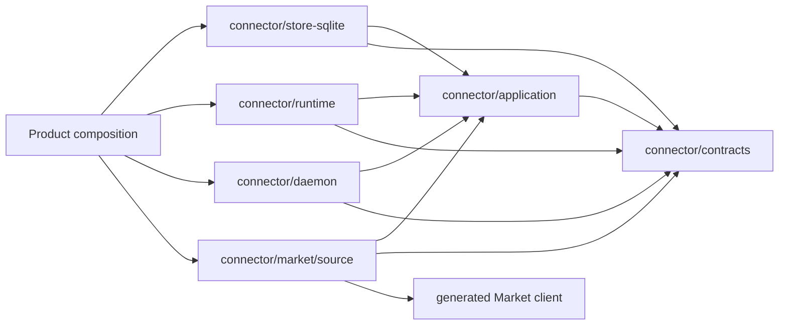
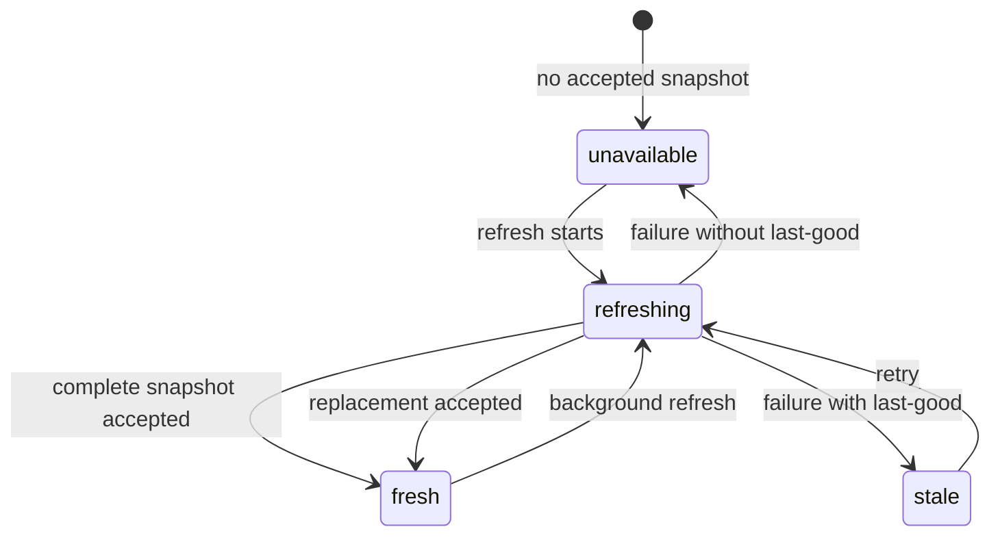

# T03: Connector application, daemon, catalog, and persistence

Status: complete and verified.

Scope: Tutti only. TSH production migration remains deferred. The server
artifact protocol is recorded in T04.

## Objective and removed coupling

The historical `packages/connector/host` package combined application use
cases, repository behavior, remote Catalog reads, command admission, recovery,
runtime planning, and policy behind one broad service. Daemon construction also
started workers before composition was complete.

That package is now deleted. The delivered system separates host-neutral
application rules, long-running lifecycle/workers, generated remote Market
adaptation, physical runtime, and Connector-owned persistence. There is one
business implementation and no dual read or runtime fallback.

## Delivered dependency direction



- Contracts have no transport, database, React, or product dependency.
- Application depends only on contracts and its declared host-neutral ports.
- Store, runtime, daemon, and Market source are parallel outer modules that
  depend on application/contracts.
- Product composition constructs and injects store, runtime, daemon, and Market
  source separately. Daemon composes narrow maintenance ports and owns workers,
  not a second state machine or the concrete outer adapters.
- Daemon's store import is limited to test fixtures; it is not a production
  module edge. `runtime/process` is a runtime-internal neutral leaf and imports
  neither contracts nor application.
- Market source is the only generated remote protocol adapter.
- Other domains cannot join Connector tables or retain application concrete
  types.

## Application composition and authoritative projection

`application.New` returns:

```text
Composition
├── Root
│   ├── StateQueries
│   ├── CatalogQueries / CatalogCommands
│   ├── InstallationCommands
│   ├── RuntimeCommands
│   ├── AuthorizationCommands
│   ├── OperationQueries
│   └── AgentConnectorPolicyQueries
└── DaemonPorts
    ├── Recovery / Operations
    ├── Catalog / Installation
    ├── Authorization
    └── Runtime
```

No HTTP or renderer consumer gets daemon maintenance controls, repositories, or
the private service. Runtime binding/identity, authorization readiness, policy,
availability, and presentation are all computed once by application.

The canonical presentation has ten states and an explicit semantic action set.
It requires exact Desired/Observed identity, generation, boot epoch, release,
binding, and physical readiness before returning `connected`. Unknown or
incomplete evidence returns `unsupported`, `degraded`, or another fail-closed
state; it never becomes selectable through optimistic inference.

Market reads and `AgentConnectorPolicyQueries` reuse this projector. Local Agent
support uses the accepted catalog. Shared support/grant is explicit, per
Connector, and missing/stale/unknown values fail closed.

## Catalog and freshness

Queries read only the local accepted Catalog snapshot. The daemon is the only
caller of the remote `CatalogSource`:



The active snapshot contains complete validated categories, ordered listings,
releases, immutable artifact descriptors, accepted time, and freshness. The
current server protocol does not supply an authoritative catalog revision, so
the sole Market source performs two complete reads and accepts them only when
structurally equal. It does not synthesize a source revision, release digest,
or artifact identity.

Refresh parses and validates outside the active transaction, then atomically
accepts the full snapshot. A failed or inconsistent read cannot partially
pollute last-good state.

Freshness policy:

- no snapshot: unavailable; browse is explicitly unavailable rather than a
  false empty catalog;
- fresh: all application-approved actions may be admitted;
- refreshing with a previously fresh snapshot: last-good remains visible;
- stale: last-good remains visible/read-only and installed runtime remains
  usable;
- stale/unavailable: install, update, and new authorization are denied;
- cleanup actions such as cancel, disconnect, uninstall, and draft removal are
  governed by canonical `allowedActions` and remain available when safe.

## Structured command behavior

Public command facades are the single normalization boundary for application
errors and transport uncertainty:

- `accepted`: a durable asynchronous operation exists;
- `completed`: the requested idempotent state is already/now complete;
- `rejected`: known validation, precondition, admission, or revision failure;
- `uncertain`: transport ended after dispatch without proof of durable
  acceptance.

Every Connector mutation carries entity revision; older global revision input
is one wire compatibility fence, not a second internal algorithm. Revision
conflicts are non-retryable. TypeScript performs authoritative refresh after
conflict/uncertainty and never blind-replays a side effect.

Authorization cancellation carries operation ID, entity/global revisions, and
a stable client request ID. The durable cancellation receipt makes an exact
request idempotent across restart and prevents a new/different request from
claiming a stale operation.

## Daemon lifecycle and health

`NewHost` validates and assembles only. `Start(ctx, initialScope)` creates one
lifecycle context, owns the initial scope, closes publication, registers every
worker, bootstraps durable state and physical observation, and rolls back partial
startup in reverse order with bounded waits. Catalog refresh starts
asynchronously and does not block recovery of installed Connectors.

`Close(ctx)` is idempotent and phased. It closes effect admission and runtime
activation, cancels workers immediately, drains commands/scope work, waits the
scheduler and workers, closes implementation commands, and performs a final
serialized publication disable. Caller cancellation cannot reopen publication
or let an older delayed enable win.

Owned workers include:

- durable operation recovery and scheduler wakeups, bounded by six persisted
  execution attempts before terminal failure;
- Catalog refresh with 30–60 second first retry and bounded jittered backoff;
- physical route watch plus periodic snapshot anti-entropy;
- authorization event/snapshot calibration;
- runtime recovery and per-Connector convergence;
- durable outbox delivery and bounded terminal cleanup.

Worker health exposes status, last success, current consecutive failures,
backoff deadline, optional failure budget/exhaustion, and stable error code. An
authorization callback alone does not prove worker success; only an
authoritative completed pass does. Runtime retry health is derived per Connector
from convergence state and is not copied from aggregate worker health.

## Persistence and one-time migration

Connector SQLite owns schema, migrations, revisions, leases, operation/outbox
history, Catalog snapshots/freshness, runtime Desired/Observed, authorization
projections, and installed-release evidence.

Canonical installed-release evidence is stored independently of operation
retention:

```text
installed release history + current pointer
  <- one-time validated legacy table/projection/completed-operation migration
  -> runtime recovery, repair, update, uninstall
```

The migration is versioned and transactional. It reads legacy sources once,
validates canonical rows, and commits rows plus a migration marker atomically.
After that marker, normal reads/writes never consult or update the legacy table
or use projection/operation JSON as fallback. A probe-detected missing
implementation keeps canonical history so repair/uninstall still targets the
accepted release.

Catalog snapshot data remains separate from installed evidence: remote removal
cannot erase what is physically installed. Short-lived signed URLs and secrets
never enter either store.

## Validation evidence

Committed slices passed focused application, daemon, store, Market source, and
runtime tests, including:

- complete/failing/stale Catalog refresh and atomic last-good behavior;
- stale install/update/new-auth denial and safe cleanup actions;
- four command outcomes, result validation, conflict/uncertainty semantics, and
  cancellation replay across restart;
- all ten presentation states, exact readiness, action policy, local/shared
  Agent rules, and unknown fail closed;
- inert construction, startup rollback, stuck command/scope/scheduler cases,
  old publication completion fencing, bounded close, worker health, and race;
- one-time installed-release migration and no post-marker legacy fallback;
- generated Market source isolation and drift checks;
- normal/race/vet and Windows compilation for affected Go modules.

The final T05/T06 TypeScript, static, and affected Go slice matrix passed. Root
closeout retains only DCO normalization, post-rebase smoke, and clean-tree
confirmation.

## Deferred and compatibility scope

- TSH production integration is intentionally deferred. It must later consume
  the released Tutti cohort and explicit shared-Agent support contract.
- One older daemon wire without `presentation` is decoded centrally to
  unsupported/read-only; consumers cannot recreate state from raw facts.
- The global mutation revision is accepted only for the older wire cohort.
- There is no dual Catalog source, application facade, database fallback,
  constructor-started worker path, or runtime feature flag.

## Acceptance

- Application, daemon, Market source, runtime, and persistence follow the
  enforced DAG.
- Catalog browsing is local and last-good; stale behavior is read-only.
- Commands, policy, identity, and presentation have one authority.
- Lifecycle is explicit, supervised, bounded, and fail closed.
- Health and retry budgets are real worker/per-Connector facts, not UI guesses.
- Canonical release evidence survives operation cleanup without legacy fallback.
- All final T06 gates pass from the rebased tree.
