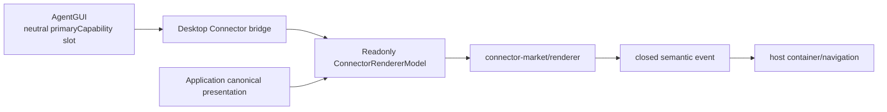

# T05: Connector renderer, neutral AgentGUI slot, and host bridges

Status: complete and verified.

## Objective

`@tutti-os/connector-market/renderer` is the only owner of Connector React UI,
dialogs, composer entry, copy, presentation display, and selection semantics.
AgentGUI contributes one optional product-neutral placement slot and generic
target/draft context. Desktop and Standalone compose the two packages and decide
only product containers/navigation after receiving a closed semantic event.

## Delivered ownership boundary



Allowed composition:

```text
AgentGUI <- Desktop bridge -> Connector /renderer -> Connector contracts/ports
```

Forbidden edges:

```text
AgentGUI -X-> @tutti-os/connector-*
Connector renderer -X-> AgentGUI | Desktop | preload | window globals
Connector services/application -X-> React | renderer
Desktop feature UI -X-> Connector mutable roots or package internals
```

## Delivered package shape

```text
packages/connector/market/src/
├── index.ts                         # non-React package surface
├── contracts/                       # host-neutral TS contracts
├── services/                        # internal application-port integration
├── composition/renderer/
│   └── connectorRendererModelAdapter.ts
├── renderer/
│   ├── index.ts                     # canonical public renderer entry
│   ├── connectorRendererModel.ts    # readonly snapshot/commands
│   ├── connectorRendererSurface.ts  # renderer-owned view DTOs
│   ├── ConnectorComposerEntry.tsx
│   └── components/                  # catalog/composer/dialog/toolbar/auth UI
├── ui/
│   └── index.ts                     # deprecated forwarding only
└── i18n/                            # Connector-owned en/zh-CN resources

packages/agent/gui/                  # optional neutral slot; no Connector code
apps/desktop/                        # model/slot/event composition only
```

`/renderer` exports the deliberate React/model/event surface. It does not
export mutable stores, internal service roots, daemon DTOs, transport clients,
projection helpers, or lifecycle controls. `/ui` is the same implementation via
one-release compile-time forwarding and contains no runtime branch.

## Neutral AgentGUI seam

AgentGUI supplies:

- exact target ID and neutral ownership (`self`/`shared`);
- disabled state;
- generic selected capability identities/opaque payloads;
- generic draft mutation;
- an optional `primaryCapability` renderer function.

It supplies no Connector catalog, status, label, callback, navigation, mapping,
or service. Missing injection or a `null` result omits only that placement;
mention, handoff, submit, and other composer capabilities continue normally.
Slot renderer identity participates in the existing memo/equality boundary.

The Connector-specific AgentGUI menu, labels, locale keys, settings branch,
package dependency, and alternate slash/menu entry were removed. The Desktop
bridge alone maps generic draft payloads to the unchanged daemon Connector wire
block; AgentGUI neither understands nor rewrites it. Generic primary-capability
draft extraction/update and opaque identity now live in a dedicated neutral
helper, separate from the main composer draft implementation.

## Readonly renderer model and closed events

One window-scoped Connector module adapts application ports to a stable readonly
model compatible with `useSyncExternalStore`. React receives immutable snapshots
and stable command/event references, not mutable services or lifecycle methods.
Credentials, grants, signed URLs, executable paths, and durable stores are never
present in a snapshot or host event.

Renderer-to-host navigation uses a closed semantic union for catalog, details,
authorization, approved external URL, account admission, and try-Connector
intent. The host exhaustively chooses the physical container/navigation. Events
are not domain success; installation/authorization/disconnect/uninstall/refresh
still execute through commands and are confirmed by authoritative snapshots.

Workspace and Standalone reuse the same bridge behavior and event handler. Each
window owns one model/root and one Connector dialog host. Streaming Session/Turn
updates must not recreate the model, commands, slot function, event sink, or
subscriptions.

Desktop now owns an explicit generated-client-to-Connector transport mapper. It
validates freshness, presentation states/actions, command results, operations,
and Connector DTOs at the host adapter boundary and fails malformed values
closed. Generated transport types do not leak into the Connector model.

Local and shared Agent policy feed the same cached window model. Shared policy
is injected once before subscription; rebinding a different policy or binding
after shared subscription fails explicitly. Missing shared policy remains an
unavailable per-Connector presentation map rather than a second model or a
renderer-side allowlist derivation.

## Canonical presentation consumption

The Go application and daemon HTTP boundary now publish a validated
`CatalogFreshness` and per-Connector `ConnectorPresentation` with exact
`allowedActions`. The TypeScript daemon client is the sole one-version legacy
decoder. Its canonical return values always include freshness/presentation; the
legacy wire fallback is read-only and never derives connected/selectable state.

The completed cutover removes all renderer/service fallback inference from:

- top-level `catalogState`, `sourceRevision`, or local mutation state;
- raw installation, authorization, compatibility, operation, and runtime facts;
- shared `supportedConnectorKeys` set intersection inside React;
- local busy state as domain truth.

Renderer and Market service admission are action-driven:

| Semantic action            | Effect owner                                                   |
| -------------------------- | -------------------------------------------------------------- |
| `install` / `update`       | Market service command admission and auto-update eligibility   |
| `authorize`                | authorization entry/dialog                                     |
| `cancel`                   | active authorization cancellation                              |
| `disconnect` / `uninstall` | cleanup commands                                               |
| `select`                   | add an unselected Connector to Agent draft                     |
| `remove_selection`         | remove an already selected Connector in any safe visible state |
| `details`                  | open Connector-owned details without implying mutability       |

Malformed/unknown presentation normalizes internally to `unsupported` with only
safe read/remove behavior. The normalizer/projector is not a public renderer
export.

Stale policy is intentionally asymmetric: an exact ready installed Connector
may remain `connected` and selectable, while install/update/new authorization
actions are absent. Cancel/disconnect/uninstall/details/draft removal remain
available only when the application explicitly includes them.

## State behavior

Application owns these closed states; renderer maps copy and visuals only:

| State                    | Selection behavior                                     | Typical allowed intent         |
| ------------------------ | ------------------------------------------------------ | ------------------------------ |
| `unavailable`            | no add; selected cleanup only                          | no Connector mutation          |
| `loading`                | no add; selected cleanup only                          | none unless present in actions |
| `setup_required`         | no add                                                 | install/details                |
| `authorization_required` | no add                                                 | authorize/details              |
| `connecting`             | no add                                                 | cancel/details                 |
| `connected`              | add only with `select`; remove with `remove_selection` | select/disconnect              |
| `degraded`               | no new add                                             | safe details/cleanup           |
| `disabled`               | no new add                                             | details/cleanup                |
| `unsupported`            | no new add                                             | details/cleanup                |
| `failed`                 | no new add                                             | details/cleanup                |

State names alone do not grant an action; `allowedActions` is authoritative.

## UI and i18n ownership

All Connector-visible copy lives in Connector Market i18n resources, including
composer, catalog, stale/unsupported/degraded/failed states, installation,
authorization, cancellation, and blocked dialogs. Hosts inject locale/runtime and
do not pass individual Connector labels.

Renderer uses only public `@tutti-os/ui-system` entries and semantic tokens.
Buttons, menus, badges, dialogs, forms, search/tabs, icons, loading/empty/error
states, focus, spacing, radius, and typography map to UI System primitives.
`@tutti-os/ui-system/styles.css` is loaded once by the Desktop renderer entry;
there are no UI System deep imports or copied AgentGUI/local visual primitives.

## Verification evidence

The completed T05 matrix proved:

- all ten states and ten actions are consumed exhaustively;
- only `select` adds a draft item and `remove_selection` controls removal;
- stale exact-connected remains usable without install/update/new-auth;
- malformed/unknown presentation becomes unsupported, never setup/connected;
- Market install/update/authorize/cancel/disconnect/uninstall/runtime-restart and auto-update
  admission depend on `allowedActions`, not raw facts;
- legacy daemon wire remains read-only and one-version bounded;
- missing AgentGUI slot hides the entry while all other controls work;
- Workspace/Standalone use the same stable bridge and one dialog host/window;
- public `/renderer` exports remain narrow and `/ui` forwards exactly;
- no product imports `/ui`, no AgentGUI Connector edge, and no renderer host/
  transport/mutable-root edge exists.

The following focused package and repository gates passed on the completed
implementation:

```bash
pnpm --filter @tutti-os/connector-market test
pnpm --filter @tutti-os/connector-market typecheck
pnpm --filter @tutti-os/connector-market build
pnpm --filter @tutti-os/agent-gui test
pnpm --filter @tutti-os/agent-gui typecheck
pnpm --filter @tutti-os/desktop test
pnpm --filter @tutti-os/desktop typecheck
pnpm --filter @tutti-os/desktop build
pnpm check:i18n
pnpm check:connector-boundaries
pnpm check:renderer-boundaries
pnpm check:agent-gui-degradation
pnpm check:api-generated
```

The checks cover canonical presentation/action rendering, explicit Desktop
transport mapping, one-model shared-policy injection, neutral AgentGUI draft
splitting, public renderer boundaries, UI/i18n boundaries, degradation budgets,
generated API drift, typechecks, tests, and builds. Post-rebase smoke remains a
root repository-closeout step.
